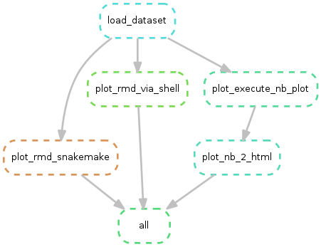

[](https://snakemake.readthedocs.io)
[](https://travis-ci.org/erblast/cookie_ds_demo)
[snakemake report](https://erblast.github.io/cookie_ds_demo//snakemake_report/)
[](https://github.com/erblast/cookie_ds_demo.git)

# cookie_ds_demo

demo of [cookie_dc project template](https://github.com/erblast/cookie_ds.git)

## Run in docker container
```
docker run -it --rm -v "$PWD":/app cookie_ds_demo
```

## Docker compose

builds cookie_ds_demo and start a shell_1 and rstudio_1 container

```
docker-compose up -d --build
docker container exec -it cookie_ds_demo_shell_1 /bin/bash 
docker-compose down
```

## Execute
```shell
snakemake
```

## Dryrun
```shell
snakemake -n

```

## Execute after code changes
```shell
snakemake -R `snakemake --list-code-changes`
```

## Force re-execution
```shell
snakemake -F
```

## Parallel Processing

```shell
snakemake --cores 3
```

## Execute and build conda environment

The conda environment will be reconstructed from `yml` file and stored in `./.snakemake/conda`.
A single conda environment can be defined for each rule.

```shell
conda env export --name cookie_ds_demo_env -f ./envs/cookie_ds_demo_env_debian.yml
```

```shell
snakemake --use-conda
```
## Test

All generalizable R functions are collected in an R package under `cookiedsdemopkgr` which is checked and tested

```
snakemake test
```


## Visualize workflow
```shell
snakemake --dag | dot -Tpng > ./docs/wflow/wflow.png
```




## Build Report

```
snakemake report # executes rules for building report building blocks
snakemake --report docs/snakemake_report/index.html
```


