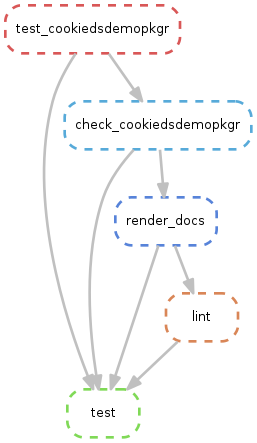

<!-- 
The content rendered from this file is used for the jekyll github page.
-->

demo of [cookie\_dc project
template](https://github.com/erblast/cookie_ds.git)

## Documentation

  - [cookiedsdemopkgr
    documentation](https://erblast.github.io/cookie_ds_demo//cookiedsdemopkgr/index.html){:target="\_blank"}

 

### Test Results

| files                                                                                   |
| :-------------------------------------------------------------------------------------- |
| \- [check\_cookiedsdemopkgr.txt](testlog/check_cookiedsdemopkgr.txt){:target="\_blank"} |
| \- [lint\_cookiedsdemopkgr.txt](testlog/lint_cookiedsdemopkgr.txt){:target="\_blank"}   |
| \- [test\_cookiedsdemopkgr.txt](testlog/test_cookiedsdemopkgr.txt){:target="\_blank"}   |

 

### Rules

| snakemake\_report                                     | workflow                                   |
| :---------------------------------------------------- | :----------------------------------------- |
| [exec](snakemake_report/exec.html){:target="\_blank"} | {:target="\_blank"} |
| [test](snakemake_report/test.html){:target="\_blank"} | {:target="\_blank"} |
| [job](snakemake_report/job.html){:target="\_blank"}   | {:target="\_blank"}   |

 

### html Files Generated by Rules

| files                                                                           |
| :------------------------------------------------------------------------------ |
| \- [plot\_jup\_nb.html](html/plot_jup_nb.html){:target="\_blank"}               |
| \- [plot\_rmd\_shell.html](html/plot_rmd_shell.html){:target="\_blank"}         |
| \- [plot\_rmd\_snakemake.html](html/plot_rmd_snakemake.html){:target="\_blank"} |

 

### png Files Generated by Rules

| files                                                              |
| :----------------------------------------------------------------- |
| {:target="\_blank"} |

 

### R and conda environment

| files                                                                        |
| :--------------------------------------------------------------------------- |
| [env\_conda\_no\_builds.yml](env/env_conda_no_builds.yml){:target="\_blank"} |
| [env\_conda.yml](env/env_conda.yml){:target="\_blank"}                       |
| [env\_R.html](env/env_R.html){:target="\_blank"}                             |
| [renv.lock](env/renv.lock){:target="\_blank"}                                |

 
